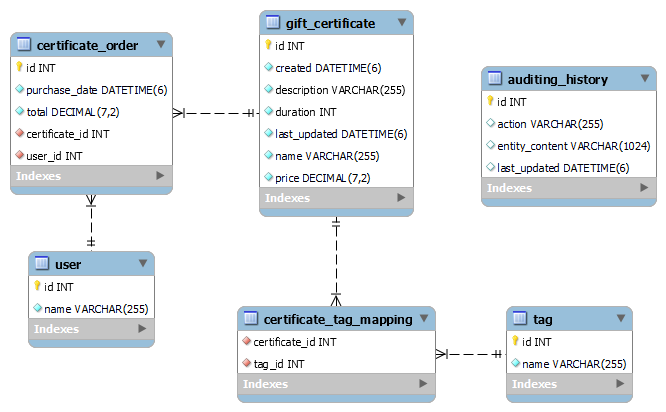

# Gift certificates REST API

This app exposes several REST API endpoints to perform operations on entities (gift certificates, tags, users...). It was built with Spring Boot, Spring MVC and Hibernate as the JPA implementation for data access. 

# Features

- CRUD operations for gift certificates (with search by multiple parameters)
- CRD operations for tags
- Read operations for users
- User's ability to order a certificate
- Pagination is implemented on all endpoints that return multiple items
- HATEOAS is implemented

# Architecture

The app has a layered structure with three layers: repository - for data access, service - for implementing business logic and web layer - for request handling and validating data.

# Frameworks/libraries used

- Spring Boot
- Spring MVC
- JPA for data access (with Hibernate as the implementation)
- MySql 
- Mockito
- Junit 5

# DB schema diagram

